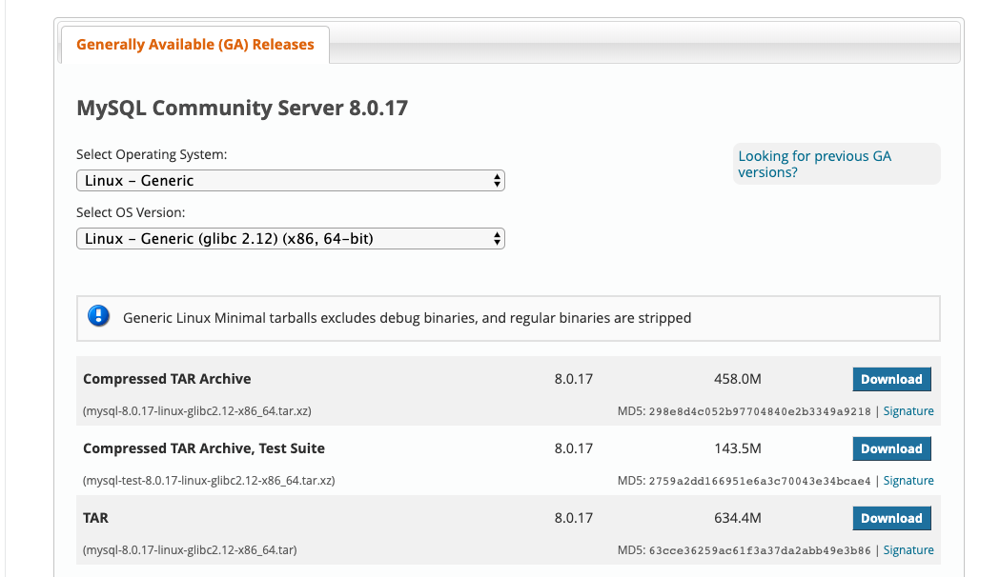

# MySQL8 clone plugin

## 安装MySQl8.0.17

* 下载

MySQL8.0.17 二进制版本

[https://dev.mysql.com/downloads/mysql/](https://dev.mysql.com/downloads/mysql/)



解压，修改权限

```
tar xf mysql-8.0.17-linux-glibc2.12-x86_64.tar -C /usr/local/

ln -sv mysql-8.0.17-linux-glibc2.12-x86_64 mysql8

chown -R mysql:mysql mysql8/*
 
```

* 配置文件

```
[client]
port                   = 5432
socket                 = /data/mysql8017/tmp/mysql.sock

[mysql]
no-auto-rehash
default-character-set  = utf8mb4
prompt=mysql(\\U[\\d])>

[mysqld]
###############basic setting#################
#skip-grant-tables
sql_mode = 'TRADITIONAL'
#ngram_token_size       = 1

basedir         = /usr/local/mysql8
datadir         = /data/mysql8017/var
port            = 5432
mysqlx_port     = 54321
admin_port      = 54322
server_id       = 158
socket          = /data/mysql8017/tmp/mysql.sock
mysqlx_socket   = /data/mysql8017/tmp/mysqlx.sock
pid-file        = /data/mysql8017/var/mysql.pid
tmpdir          = /data/mysql8017/tmp

default_authentication_plugin   =mysql_native_password
explicit_defaults_for_timestamp = 1
auto_increment_increment        = 1
auto_increment_offset           = 1
#lower_case_table_names         = 1 

secure-file-priv = '/data/mysql8017/tmp'

default-time-zone        = system
character-set-server     = utf8mb4
collation_server         = utf8mb4_general_ci
#default_collation_for_utf8mb4 = utf8mb4_general_ci

interactive_timeout     = 1800
wait_timeout            = 1800
max_connections         = 2000
max_allowed_packet      = 64M

#####skip
#skip-name-resolve
#skip-grant-tables
#skip-external-locking
#skip-networking
skip-slave-start

thread_cache_size       = 768

####log settings###############

expire_logs_days = 7

log-bin                  = mysql-bin
log-bin-index            = mysql-bin.index
relay-log                = relay-log
relay_log_index          = relay-log.index

#log-warnings            = 1
log_error_verbosity      = 3
log-error                = /data/mysql8017/log/mysql.err

slow_query_log           = 1
long-query-time          = 1
log_queries_not_using_indexes = 1
log_throttle_queries_not_using_indexes = 10
log_slow_admin_statements = 1
log_slow_slave_statements = 1
#min_examined_row_limit = 100
slow_query_log_file      = /data/mysql8017/log/slow.log

general_log              = 0
general_log_file         = /data/mysql8017/log/mysql.log
max_binlog_size          = 1G
max_relay_log_size       = 1G

#####InnoDB setting###########

default_storage_engine          = innodb
innodb_buffer_pool_size = 4G
innodb_data_home_dir            = /data/mysql8017/var
innodb_data_file_path           = ibdata1:1G:autoextend
innodb_temp_data_file_path      = ibtmp1:12M:autoextend:max:10G
innodb_lru_scan_depth           = 2000
innodb_file_per_table           = 1
innodb_write_io_threads         = 8
innodb_read_io_threads          = 8
innodb_purge_threads            = 8
innodb_thread_concurrency       = 0
innodb_flush_log_at_trx_commit  = 0
innodb_log_buffer_size          = 32M
innodb_log_file_size            = 2G
innodb_log_files_in_group       = 3
innodb_log_group_home_dir       = /data/mysql8017/var
innodb_flush_neighbors          = 1
innodb_print_all_deadlocks      = 1
innodb_strict_mode              = 1
innodb_sort_buffer_size         = 67108864
innodb_undo_tablespaces         = 3
innodb_max_dirty_pages_pct      = 75
innodb_flush_method             = O_DIRECT
innodb_lock_wait_timeout        = 5
innodb_open_files               = 65535
innodb_use_native_aio           = on
innodb_buffer_pool_dump_pct     = 40
innodb_page_cleaners            = 4
innodb_undo_log_truncate        = 1
innodb_purge_rseg_truncate_frequency = 128
binlog_gtid_simple_recovery     = 1
innodb_io_capacity              = 2000
innodb_io_capacity_max          = 3000
log_timestamps                  = system

###replication settings###########

master_info_repository          = table
relay_log_info_repository       = table

binlog_format                   = row
sync_binlog                     = 0
transaction_isolation           = READ-COMMITTED
log_slave_updates               = on
relay_log_recovery              = 1

#for gtid
gtid_mode                       = on
enforce_gtid_consistency        = on
binlog_gtid_simple_recovery     = 1

#####MyISAM setting##########
key_buffer_size             = 128M
read_buffer_size            = 8M
read_rnd_buffer_size        = 8M
join_buffer_size            = 8M
bulk_insert_buffer_size     = 64M
sort_buffer_size            = 8M
myisam_sort_buffer_size     = 1G
myisam_max_sort_file_size   = 10G
myisam_repair_threads       = 1
table_open_cache            = 4096


[mysqldump]
quick
max_allowed_packet = 64M


[myisamchk]
key_buffer_size = 64M 
sort_buffer_size = 16M
read_buffer_size = 64M
write_buffer_size = 64M

[mysqlhotcopy]
interactive-timeout
```


* 初始化

```
cd /usr/local/mysql8

./bin/mysqld --defaults-file=/data/mysql8017/etc/my.cnf --user=mysql --initialize 

```


* 启动

```
/usr/local/mysql8/bin/mysqld --defaults-file=/data/mysql8017/etc/my.cnf --user=mysql &
```


## 安装clone plugin

* 命令行加载插件

```
INSTALL PLUGIN clone SONAME 'mysql_clone.so';

```

* 配置文件启动时加载

```
[mysqld]
plugin-load-add=mysql_clone.so

```

* 强制启动时，必须加载clone插件

```
[mysqld]
plugin-load-add=mysql_clone.so
clone=FORCE_PLUS_PERMANENT
```

## 本地 clone

* clone 需要游clone_admin权限的用户才能clone，本地实验使用root

```
GRANT BACKUP_ADMIN ON *.* TO 'clone_user';
```

* 本地执行clone

```
clone local data directory ='clone_dir';

clone_dir  MySQL 有写入权限
```

```
mysql> clone local data directory ='/data/mysql8/clone_data/mysql8017';
Query OK, 0 rows affected (5 min 13.88 sec)

```

## 远程 clone

```
set global clone_valid_donor_list='192.168.64.154:5432'

clone instance from gao@192.168.64.154:5432 identified by '213456' data directory = '/data/backup/clone/mysql8';
```

## 验证

```
mkdir -pv /data/mysql8/{etc,var,log,tmp}
mv /data/backup/clone/mysql8/* /data/mysql8/var/

/usr/local/mysql8/bin/mysqld --defaults-file=/data/mysql8/etc/my.cnf --user=mysql &
```

```
mysql> use performance_schema;
Reading table information for completion of table and column names
You can turn off this feature to get a quicker startup with -A

show Database changed
mysql> show tables like '%clone%';
+----------------------------------------+
| Tables_in_performance_schema (%clone%) |
+----------------------------------------+
| clone_progress                         |
| clone_status                           |
+----------------------------------------+
2 rows in set (0.01 sec)

mysql> select * from clone_status ;
+------+------+-----------+-------------------------+-------------------------+---------------------+----------------+----------+---------------+-----------------+-----------------+---------------+
| ID   | PID  | STATE     | BEGIN_TIME              | END_TIME                | SOURCE              | DESTINATION    | ERROR_NO | ERROR_MESSAGE | BINLOG_FILE     | BINLOG_POSITION | GTID_EXECUTED |
+------+------+-----------+-------------------------+-------------------------+---------------------+----------------+----------+---------------+-----------------+-----------------+---------------+
|    1 |    0 | Completed | 2019-07-30 18:09:20.763 | 2019-07-31 11:29:31.355 | 192.168.64.154:5432 | LOCAL INSTANCE |        0 |               | mybinlog.000007 |             565 |               |
+------+------+-----------+-------------------------+-------------------------+---------------------+----------------+----------+---------------+-----------------+-----------------+---------------+
1 row in set (0.00 sec)

mysql> select * from clone_progress ;
+------+-----------+-----------+----------------------------+----------------------------+---------+------------+------------+------------+------------+---------------+
| ID   | STAGE     | STATE     | BEGIN_TIME                 | END_TIME                   | THREADS | ESTIMATE   | DATA       | NETWORK    | DATA_SPEED | NETWORK_SPEED |
+------+-----------+-----------+----------------------------+----------------------------+---------+------------+------------+------------+------------+---------------+
|    1 | DROP DATA | Completed | 2019-07-30 18:09:20.762836 | 2019-07-30 18:09:21.038340 |       1 |          0 |          0 |          0 |          0 |             0 |
|    1 | FILE COPY | Completed | 2019-07-30 18:09:21.038469 | 2019-07-30 18:09:37.925766 |       2 | 1133629497 | 1133629497 | 1133697917 |          0 |             0 |
|    1 | PAGE COPY | Completed | 2019-07-30 18:09:37.925995 | 2019-07-30 18:09:38.228929 |       2 |          0 |          0 |        197 |          0 |             0 |
|    1 | REDO COPY | Completed | 2019-07-30 18:09:38.229253 | 2019-07-30 18:09:38.530556 |       2 |       6144 |       6144 |       6639 |          0 |             0 |
|    1 | FILE SYNC | Completed | 2019-07-30 18:09:38.530749 | 2019-07-30 18:09:54.844468 |       2 |          0 |          0 |          0 |          0 |             0 |
|    1 | RESTART   | Completed | 2019-07-30 18:09:54.844468 | 2019-07-31 11:29:25.573844 |       0 |          0 |          0 |          0 |          0 |             0 |
|    1 | RECOVERY  | Completed | 2019-07-31 11:29:25.573844 | 2019-07-31 11:29:31.355007 |       0 |          0 |          0 |          0 |          0 |             0 |
+------+-----------+-----------+----------------------------+----------------------------+---------+------------+------------+------------+------------+---------------+
7 rows in set (0.00 sec)

mysql> 
```

tips:

* 配置文件中目录，字符集 和donor实例保持一致
* 用clone数据启动的实例可用donor实例的从库

## reference

[https://dev.mysql.com/doc/refman/8.0/en/clone-plugin-remote.html](https://dev.mysql.com/doc/refman/8.0/en/clone-plugin-remote.html)